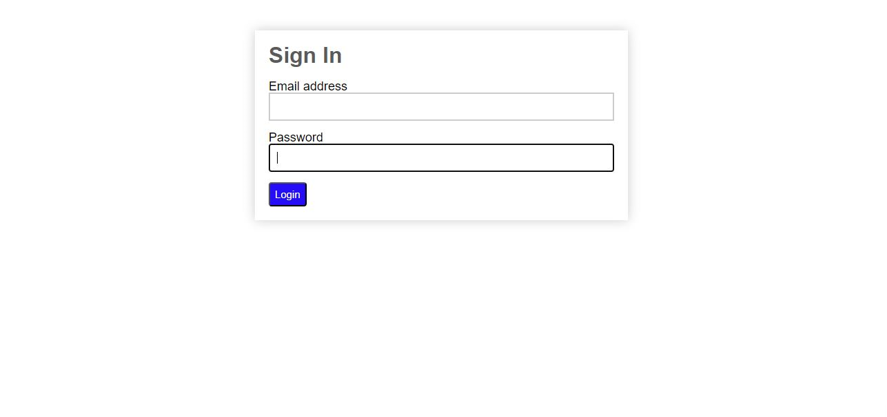

# Tugas Pemrograman Web 2
# Praktikum 8
## Profile
<body>
    <table border="1">
        <tr>
            <th> Nama</th>
            <th>NIM</th>
            <th>Kelas</th>
        </tr>
        <tr>
            <td>Adam Surya Ananda</td>
            <td>312110297</td>
            <td>TI.21.A.1</td>
        </tr>
    </table>
</body>

## Intruction
Melanjutkan praktikum sebelumnya pada repository dengan nama **`Lab7Web.`**

## Step by Step
## BwaT Tabel
 ```
CREATE TABLE user (
 id INT(11) auto_increment,
 username VARCHAR(200) NOT NULL,
 useremail VARCHAR(200),
 userpassword VARCHAR(200),
 PRIMARY KEY(id)
);
```


## SQL LOgIn
```
<?php
namespace App\Models;
use CodeIgniter\Model;
class UserModel extends Model
{
 protected $table = 'user';
 protected $primaryKey = 'id';
 protected $useAutoIncrement = true;
 protected $allowedFields = ['username', 'useremail', 'userpassword'];
}
```


## Model User
Buat Controller baru dengan nama `User.php` pada direktori `app/Controllers`
Kemudian tambahkan `method index()` untuk menampilkan daftar user, dan method 
`login()` untuk proses login.

```
<?php
namespace App\Controllers;
use App\Models\UserModel;
class User extends BaseController
{
 public function index() 
 {
 $title = 'Daftar User';
 $model = new UserModel();
 $users = $model->findAll();
 return view('user/index', compact('users', 'title'));
 }
 public function login()
 {
 helper(['form']);
 $email = $this->request->getPost('email');
 $password = $this->request->getPost('password');
 if (!$email)
 {
 return view('user/login');
 }
 $session = session();
 $model = new UserModel();
 $login = $model->where('useremail', $email)->first();
 if ($login)
 {
 $pass = $login['userpassword'];
 if (password_verify($password, $pass))
 {
 $login_data = [
'user_id' => $login['id'],
 'user_name' => $login['username'],
 'user_email' => $login['useremail'],
 'logged_in' => TRUE,
 ];
 $session->set($login_data);
 return redirect('admin/artikel');
 }
 else
 {
 $session->setFlashdata("flash_msg", "Password salah.");
 return redirect()->to('/user/login');
 }
 }
 else
 {
 $session->setFlashdata("flash_msg", "email tidak terdaftar.");
 return redirect()->to('/user/login');
 }
 }
}
```
## View LOgIn 
Buat New Directory dengan nama `user` pada direktori app/views, kemudian buat file 
baru dengan nama `login.php.`
```
<!DOCTYPE html>
<html lang="en">
<head>
 <meta charset="UTF-8">
 <title>Login</title>
 <link rel="stylesheet" href="<?= base_url('/loginstyle.css');?>">
</head>
<body>
 <div id="login-wrapper">
 <h1>Sign In</h1>
 <?php if(session()->getFlashdata('flash_msg')):?>
 <div class="alert alert-danger"><?=
session()->getFlashdata('flash_msg') ?></div>
 <?php endif;?>
 <form action="" method="post">
 <div class="mb-3">
 <label for="InputForEmail" class="form-label">Email 
address</label>
 <input type="email" name="email" class="form-control"
id="InputForEmail" value="<?= set_value('email') ?>">
 </div>
<div class="mb-3">
 <label for="InputForPassword"
class="form-label">Password</label>
 <input type="password" name="password"
class="form-control" id="InputForPassword">
 </div>
 <button type="submit" class="btn 
btn-primary">Login</button>
 </form>
 </div>
</body>
</html>
```
## User Seeder bukan User Roam
Dilanjut dengan Membuat `database seeder`, Buka CLI Kemudyan Masukkan Perintah
 `php spark make:seeder UserSeeder` , Open file `UserSeeder` pada Lokasi /app/Database/Seeds/UserSeeder.php,
 Masukkan atau Masukkin? perintah berikut :

 ```
<?php
namespace App\Database\Seeds;
use CodeIgniter\Database\Seeder;
class UserSeeder extends Seeder
{
public function run()
{
$model = model('UserModel');
$model->insert([
'username' => 'admin',
'useremail' => 'admin@email.com',
'userpassword' => password_hash('admin123', PASSWORD_DEFAULT),
]);
}
}
```
Masuk kembali ke CLI lalu masukkan perintah beikut : `php spark db:seed UserSeeder`

- Akses File  dengan url :  http://localhost:8080/user/login

## Outvut




## Done
# Panjang Umur Untuk Semua Hal-Hal Baik